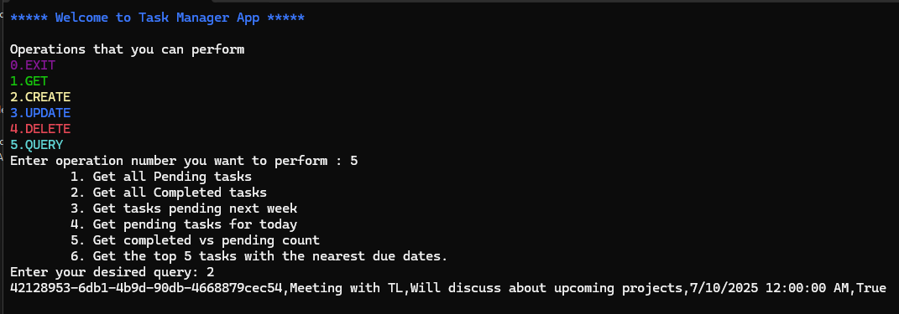

# Task Management App

**Author:** Mahin Rashid Chowdhury  
**Project Title:** Project 01 : Console‑based app – C#  
**Primary Supervisor:** Nafisur Rahman bhai  

---

## Introduction

The **TaskManager** project is a console‑based application written in **C#** on .NET.  
It helps users create, view, edit, delete, and query tasks. Data is stored
persistently via JSON serialization, and the codebase follows object‑oriented
design principles—especially the SOLID guidelines—for maintainability and
extensibility.

## Objectives

- Implement a task‑management system with full CRUD functionality.  
- Use JSON for data persistence.  
- Provide rich querying capabilities over task data.  
- Apply SOLID and interface‑based design for future extensibility.  
- Leverage LINQ for flexible task queries.  

## System Architecture

### User Interaction Layer
- Handles all console I/O.  
- Exposes an `IConsoleInteraction` abstraction.  
- Concrete implementation: `ConsoleInteraction`.

### Application Control Layer
- Central orchestration via `TaskManagerApp`.  
- Bridges user input with core business operations.  
- Maintains control flow and application lifecycle.

### Core Business Logic
All domain rules live here, split into focused components:

| Component | Responsibility |
|-----------|----------------|
| `TaskCreator` | Add new tasks |
| `TaskGetter`  | Retrieve tasks (single or list) |
| `TaskEditor`  | Update existing tasks |
| `TaskDeletor` | Delete tasks by ID |
| `TaskQuery`   | Filter tasks by status/date/etc. |

### Data Access Abstraction
- Interface: `IDataRepository`  
- Concrete store: `DataRepository` (in‑memory list of tasks)

### File Storage Abstraction
- Interface: `IFileRepository`  
- Concrete store: `FileRepository` (JSON read/write)

### File System
- Persists task data inside the repo (e.g., `tasks.json`) in JSON format.

## Software Design Principles (SOLID)

| Principle | How It’s Applied |
|-----------|------------------|
| **Single Responsibility** | Each class tackles one job—e.g., `TaskDeletor` only deletes tasks. |
| **Open/Closed** | New features (like alternative input) can be added without modifying existing code thanks to interfaces. |
| **Liskov Substitution** | Any implementation of an interface can replace another without breaking correctness. |
| **Interface Segregation** | Fine‑grained contracts—`IFileRepository` contains only file operations, avoiding “fat” interfaces. |
| **Dependency Inversion** | High‑level modules depend on abstractions (`IDataRepository`, `IFileRepository`), not concretions. |

## Project Output

### User‑specific Queries

### All Tasks

## Limitations

1. Console‑only UI (no GUI yet).  
2. Minimal input validation/error handling (e.g., no ID format checks).  
3. Tasks live in memory; data is saved only on exit unless explicitly persisted.

## Conclusion

The TaskManager app delivers a modular, extensible, and maintainable task
management system using modern C# practices. Through SOLID design, it
demonstrates clean separation of concerns, strong OOP fundamentals, and easy
paths for future feature growth.
